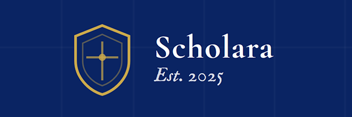
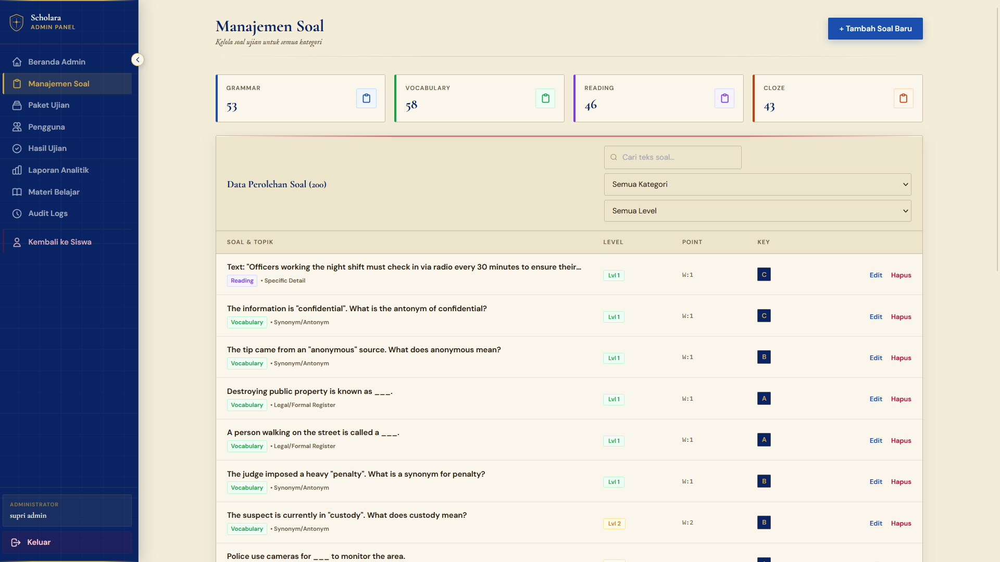
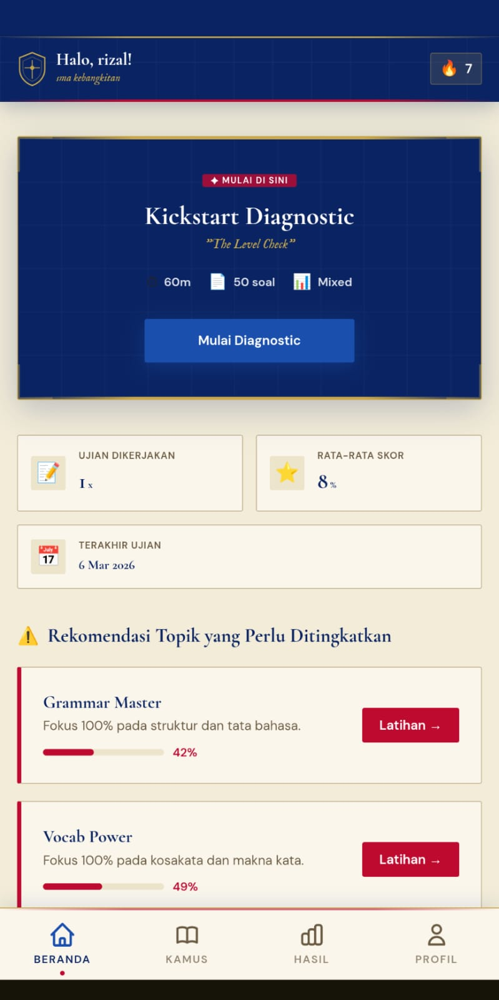
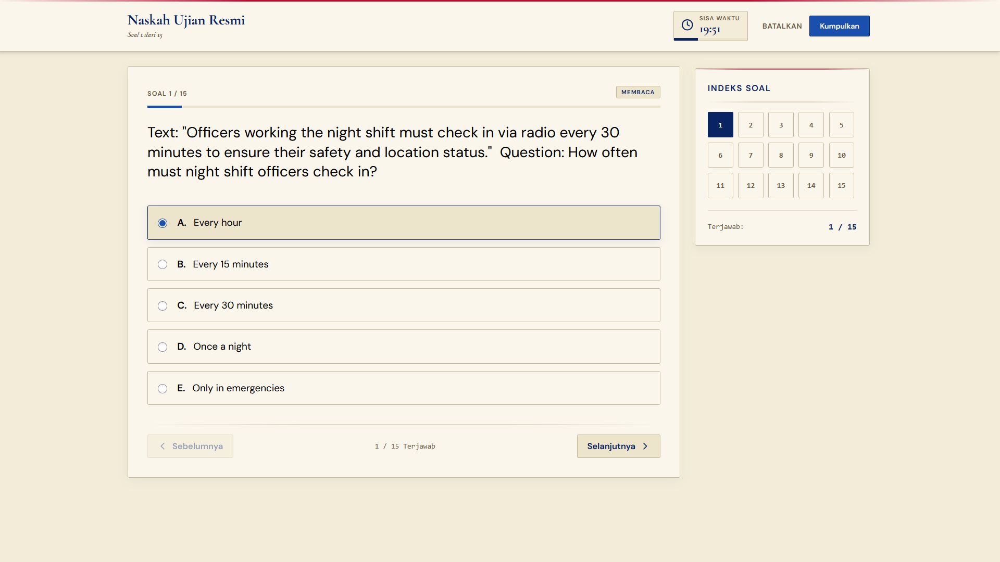
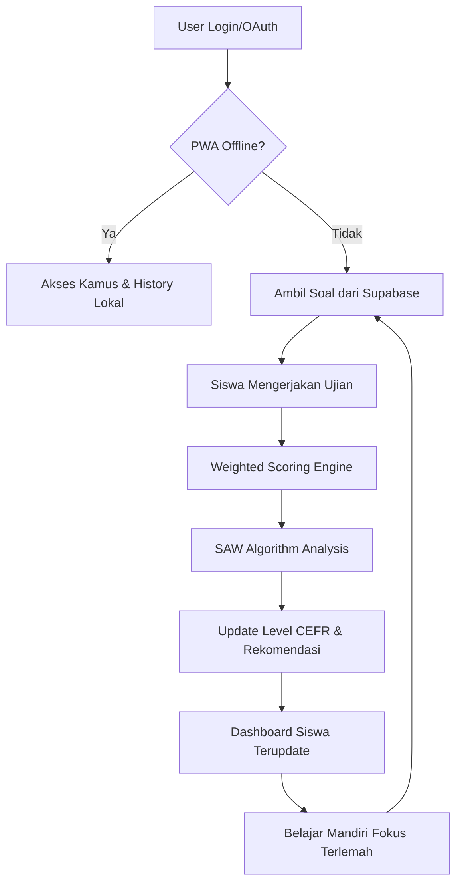

# Scholara - Advanced Exam & Learning Recommendation System



**Scholara** adalah platform simulasi ujian bahasa Inggris yang dirancang untuk mereplikasi pengalaman ujian nyata sekaligus memberikan rekomendasi belajar yang adaptif. Sistem ini memanfaatkan algoritma **SAW (Simple Additive Weighting)** untuk menganalisis performa ujian dan secara otomatis menentukan prioritas materi yang perlu dipelajari pengguna.

## Screenshots & Demo

> [!NOTE]
> Bagian ini disediakan untuk dokumentasi visual aplikasi.

| Desktop Dashboard                                | Mobile View                                        | Exam Interface                                   |
| :----------------------------------------------- | :------------------------------------------------- | :----------------------------------------------- |
|  |  |  |

### 🔗 Live Demo & Repository

- **Online Demo:** (https://saw-spk-bingg.vercel.app)
- **Repository:** (https://github.com/hnderwn/saw-spk-bingg)

---

## 🚀 Fitur Unggulan

### 🎓 Untuk Siswa (Siswa)

- 🔐 **Authentication Multi-Method**: Login aman via Email atau **Google OAuth**.
- 📊 **Intelligent Dashboard**: Pantau skor CEFR, statistik progres, dan riwayat ujian.
- 📱 **Premium Mobile Experience**: Navigasi bawah (Bottom Nav) yang intuitif dan responsif.
- 🎯 **SAW Recommendations**: Algoritma cerdas yang menganalisis area terlemah untuk prioritas belajar.
- 📖 **Offline Dictionary**: Kamus bahasa Inggris lengkap yang tetap bisa diakses tanpa internet.
- 💾 **PWA Support**: Install aplikasi di HP/Desktop dan akses materi secara offline.

### ⚡ Fitur Teknis & Algoritma

- 🧮 **Simple Additive Weighting (SAW)**: Perhitungan presisi untuk menentukan kategori mana yang paling membutuhkan perbaikan.
- 📈 **CEFR Mapping**: Penilaian standar internasional (A1-C2) secara otomatis berdasarkan performa ujian.
- 🔄 **Offline Sync**: Mengerjakan ujian saat offline? Data akan otomatis sinkron ke Supabase saat koneksi kembali.
- 📦 **IndexedDB Storage**: Penyimpanan lokal yang kuat untuk data ujian dan kamus ribuan kata.

### 🛠️ Untuk Admin

- 🎛️ **Smart Question Management**: Kelola soal dengan tingkat kesulitan dan bobot poin yang dinamis.
- 📈 **Advanced Analytics**: Grafik performa siswa dan log aktivitas sistem yang komprehensif.

---

## 🔄 Alur Kerja Aplikasi (Application Flow)

1. **Onboarding**: User mendaftar/masuk dan otomatis profil dibuat di database Supabase via Database Trigger.
2. **Simulasi Ujian**: Siswa mengerjakan paket soal (Diagnostic/Practice). Setiap jawaban benar dihitung berdasarkan **Bobot Poin**.
3. **Analisis SAW**: Setelah ujian, sistem memproses skor per kategori menggunakan algoritma SAW:
   - Menghitung _Cost_ (jarak ke skor sempurna).
   - Menerapkan _Weight_ (kepentingan kategori).
   - Menghitung _Foundation Multiplier_ (jika banyak salah di level dasar).
4. **Rekomendasi**: Dashboard menampilkan kategori prioritas (Kritis, Tinggi, Sedang, Rendah) beserta saran materi belajar.
5. **Iterasi**: Siswa belajar menggunakan materi rekomendasi dan mengulang ujian untuk melihat progres kenaikan level CEFR.



---

- 👥 **Student & Audit Logs**: Monitor pendaftaran pengguna dan setiap perubahan sistem secara transparan.

---

## 🛠️ Technology Stack

- **Core**: [React 18](https://reactjs.org/) + [Vite](https://vitejs.dev/)
- **Backend/Auth**: [Supabase](https://supabase.com/) (PostgreSQL + Realtime)
- **State/Caching**: React Context API + [IndexedDB](https://developer.mozilla.org/en-US/docs/Web/API/IndexedDB_API)
- **Styling**: [Tailwind CSS](https://tailwindcss.com/) (Scholara Design System)
- **PWA**: [Vite PWA Plugin](https://vite-pwa-org.netlify.app/)
- **Icons**: [Lucide React](https://lucide.dev/)

---

## 🏗️ Struktur Proyek

```
src/
├── components/          # Komponen UI Reusable (Layout, Exam, Common)
├── context/            # Management state global (Auth, Theme)
├── hooks/              # Custom hooks untuk logika spesifik
├── lib/                # Konfigurasi library (Supabase, SAW Engine)
├── pages/              # Halaman utama profil Siswa & Admin
├── utils/              # Helper functions & IndexedDB logic
└── App.jsx             # Root Routing & Layout Wrapper
```

---

## ⚙️ Instalasi & Setup

### 1. Persyaratan

- Node.js 18.x atau lebih tinggi
- Akun Supabase (Gratis)

### 2. Langkah Instalasi

```bash
# Clone repository
git clone <repository-url>
cd scholara-app

# Install dependencies
npm install

# Jalankan server development
npm run dev
```

### 3. Konfigurasi Environment (`.env`)

Buat file `.env` di root folder:

```env
VITE_SUPABASE_URL=https://your-project.supabase.co
VITE_SUPABASE_ANON_KEY=your-anon-key
```

---

## 📐 Logika Skor & SAW

Scholara menggunakan metode **Weighted Percentage** untuk penilaian ujian:

- **Difficulty (1-3)**: Mempengaruhi pemetaan level CEFR.
- **Weight (1-3)**: Menentukan poin yang didapat per soal.

**SAW Calculation:**
Sistem menghitung nilai preferensi untuk setiap kategori (Grammar, Vocab, Reading, Cloze) berdasarkan skor terendah dan bobot kepentingan, memberikan _output_ urutan materi yang paling mendesak untuk dipelajari.

---

## 📜 Lisensi & Kontribusi

Proyek ini dilisensikan di bawah **MIT License**. Kami sangat terbuka untuk kontribusi fitur baru atau perbaikan bug via Pull Request.

---

**✦ Scholara - Elevating English Proficiency Through Data ✦**
